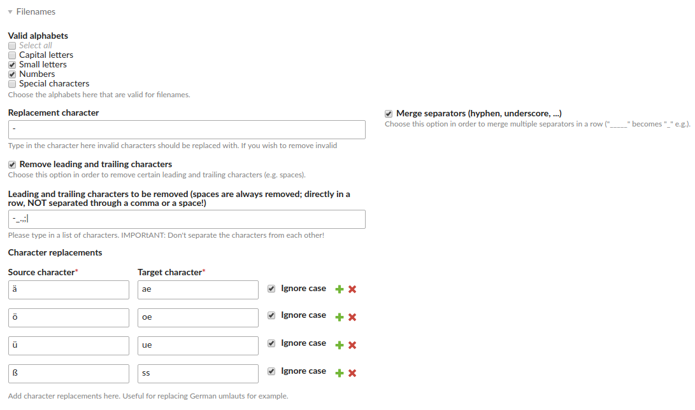

# Contao Filename Sanitizer Bundle

This bundle offers functionality for sanitizing filenames, i.e. replacing unwanted characters like whitespaces, non-ascii characters, ... (e.g. while uploading them to the CMS).

## Features

- sanitize filenames while uploading files using the Contao file manager
- sanitize filenames while saving a given file using the Contao file manager
- configurable sanitizing rules:
  - valid alphabets (the characters which are valid in the end -> "whitelist")
  - trimming
  - replacing of repeating (consecutive) hyphens or underscores
- service is also available for various other use cases besides file upload
- define a set of 1:1 character replacements (useful for German umlauts, i.e. ä => ae)
- use the `SanitizeCommand` in order to sanitize the filenames of files/folders already in the system and automatically create htaccess rewrite rules in order to keep deep links working

## Default sanitizing rules after installation of this bundle



Configuration in Contao's global settings

## Installation

Install via composer: `composer require heimrichhannot/contao-filename-sanitizer-bundle` and update your database.

## Configuration

You can configure the sanitizing rules in the global Contao settings under "file names".

## Important notes

### When is the sanitizing done exactly?

There are different situations where the filename sanitizing (which affects files and folders) takes place:

1. A new file is uploaded by using Contao's file manager (files uploaded by FTP are of course not covered)
1. An already existing file is saved by using Contao's file manager.
1. An already existing folder is saved by using Contao's file manager. **Files inside the folder are NOT sanitized automatically!**
1. By using the command `huh_filename_sanitizer:sanitize`. See below for more details.

### What about already existing files and folders and the links to these?

**IMPORTANT:** The sanitizing rules are applied when saving a file or folder already existing.

#### The file or folder is linked in the system by binary UUID

This is the case if you have used `fileTree` widgets (file pickers) in news or content elements for example. Same applies if you have used inserttags like `{{file::some-hash-uuid}}`.

In this case the links will be working even after the sanitizing has been done because the link is done by an immutable binary UUID stored in the database.

#### The file or folder is linked in the system by a hardcoded path

Files and folders already present in the system 

**Caution: Files not linked by UUIDs are DEAD after filename sanitizing has been used.**

You'll have to create htaccess rules to redirect the old paths to the new ones in this case.

#### The file or folder if linked from outside of the system

In this case it's of course always a hardcoded path. You'll have to create htaccess rules to redirect the old paths to the new ones in this case.

## Commands

### Sanitize Command

This command is designed for sanitizing existing files as a batch processing. Please use it with caution!

Features:

- process files or folders (one or more by passing a pipe ("|") separated list of IDs or paths)
- run as dry-run to see what would have been done if the command is executed
- generate a set of htaccess rules to redirect the old paths to the new ones (pass in a `domain`)

Usage:

```
vendor/bin/contao-console huh_filename_sanitizer:sanitize [options]
```

Options:
```
    --dry-run[=DRY-RUN]      See what the command would do [default: false]
    --ids[=IDS]              Pass in one or a comma separated list of IDs (tl_files.id); example: 1,2,3
    --paths[=PATHS]          Pass in one or a *pipe* separated list of paths (relative to the Contao root directory); example: files|files/some-folder|files/Hello, John
-R, --recursive[=RECURSIVE]  Also process files/folders inside folders [default: false]
    --domain[=DOMAIN]        The domain for the htaccess rewrite rules
```

## Events

Name | Arguments
---- | ---------
`AfterFilenameSanitizationEvent` | `string $file`
`AfterFolderSanitizationEvent` | `string $folder`
`AfterStringSanitizationEvent` | `string $string`
`BeforeFilenameSanitizationEvent` | `\Contao\File file`
`BeforeFolderSanitizationEvent` | `\Contao\Folder $folder`
`BeforeStringSanitizationEvent` | `string $string`
